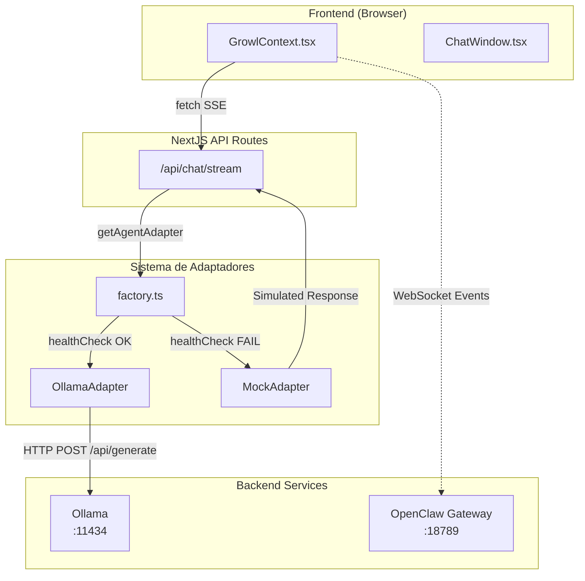
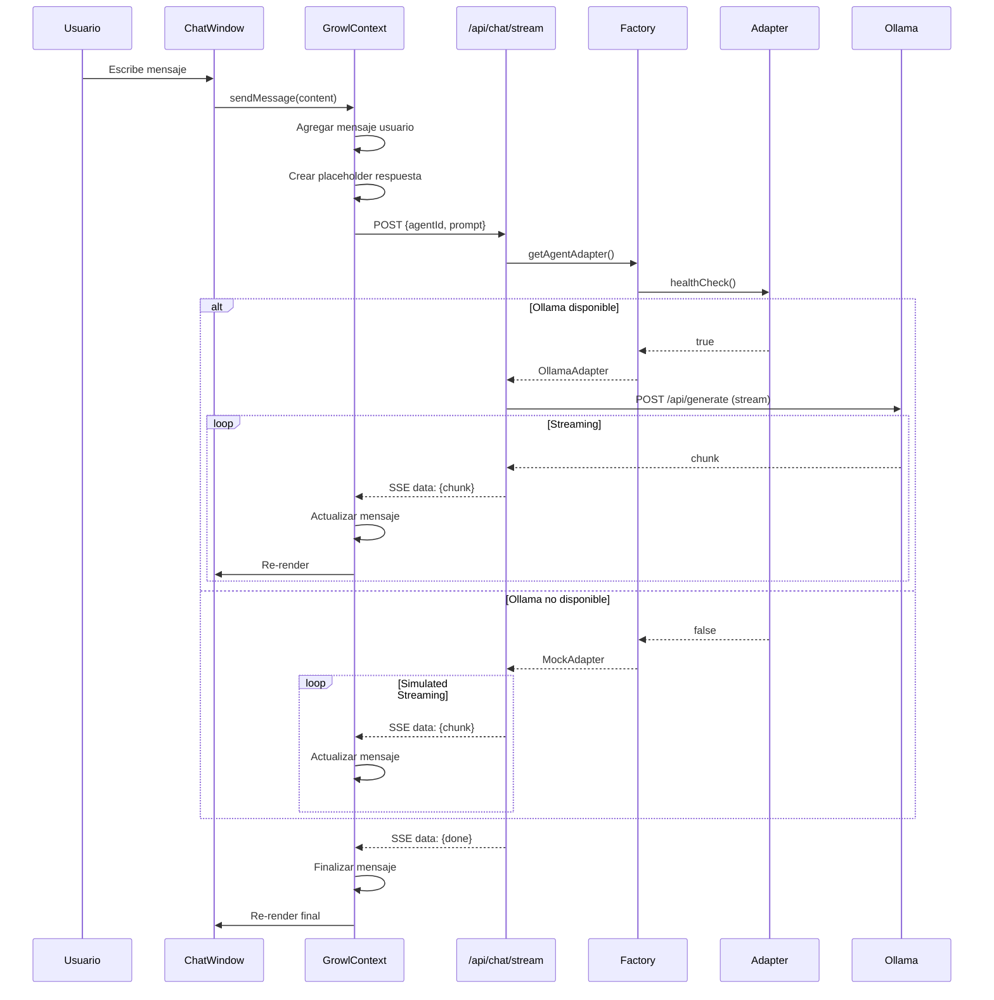

# PASCUAL Dashboard - Contrato de Integración

> Documento técnico que define el contrato entre el Dashboard NextJS y PASCUAL-BOT

## Tabla de Contenidos

- [1. Especificación de API](#1-especificación-de-api)
- [2. Base de Datos](#2-base-de-datos)
- [3. Integración con Agentes](#3-integración-con-agentes)
- [4. Componentes NextJS](#4-componentes-nextjs-requeridos)
- [5. Seguridad](#5-seguridad)
- [6. Performance](#6-performance)
- [7. Checklist de Implementación](#7-checklist-de-implementación)

---

## 1. Especificación de API

### 1.1 Endpoints Disponibles

| Endpoint | Método | Descripción | Timeout |
|----------|--------|-------------|---------|
| `POST /api/chat/stream` | POST | Chat streaming SSE | Varía por agente |
| `GET /api/chat/stream` | GET | Health check del adaptador | 3000ms |
| `GET /api/agents` | GET | Lista de agentes (futuro) | 5000ms |
| `GET /api/agents/:id/status` | GET | Estado de agente (futuro) | 5000ms |
| `PUT /api/agents/:id/model` | PUT | Cambiar modelo (futuro) | 10000ms |

### 1.2 Timeouts por Agente

| Agente | Modelo | Ubicación | Timeout | Respuesta Típica |
|--------|--------|-----------|---------|------------------|
| **PASCUAL** | qwen2.5:1.5b | CPU | 30s | 2-3s |
| **NEXUS** | qwen2.5:14b | GPU 25L | 120s | 10-15s |
| **HUNTER** | qwen2.5:3b | GPU 35L | 45s | 2-5s |
| **WARDEN** | llama3.2:1b | CPU | 30s | 3-5s |

### 1.3 Chat Streaming - Request/Response

**Request:**
```typescript
POST /api/chat/stream
Content-Type: application/json

{
  "agentId": "pascual" | "nexus" | "hunter" | "warden",
  "prompt": string,
  "options": {
    "temperature": number,    // 0.0-1.0, default: 0.7
    "maxTokens": number,      // default: 2048
    "systemPrompt": string    // opcional
  }
}
```

**Response (SSE - Server-Sent Events):**
```typescript
// Evento de inicio
data: {"type":"start","agentId":"pascual","adapter":"OllamaAdapter","timestamp":1699123456789}

// Chunks de contenido (múltiples)
data: {"type":"chunk","content":"H","metadata":{"tokensGenerated":1,"timeElapsed":100}}
data: {"type":"chunk","content":"o","metadata":{"tokensGenerated":2,"timeElapsed":115}}
data: {"type":"chunk","content":"l","metadata":{"tokensGenerated":3,"timeElapsed":130}}
// ... más chunks

// Evento de finalización
data: {"type":"done","metadata":{"tokensGenerated":150,"timeElapsed":2500}}

// En caso de error
data: {"error":"Connection timeout"}
```

### 1.4 JSON Schemas

```typescript
// Tipos de Agentes
type AgentId = "pascual" | "nexus" | "hunter" | "warden";

// Configuración de Agente
interface AgentConfig {
  model: string;
  timeout: number;
  description: string;
  location: "CPU" | "GPU";
}

// Chunk de Streaming
interface StreamChunk {
  content: string;
  done: boolean;
  metadata?: {
    tokensGenerated?: number;
    timeElapsed?: number;
  };
}

// Mensaje de Chat
interface ChatMessage {
  id: string;
  type: "user" | "assistant" | "system";
  content: string;
  agentId?: string;
  agentName?: string;
  agentIcon?: string;
  timestamp: string;
  isStreaming?: boolean;
  source: "main" | "growl";
}
```

### 1.5 Manejo de Errores

| Código | Descripción | Acción Recomendada |
|--------|-------------|-------------------|
| 400 | Request inválido | Verificar formato JSON |
| 404 | Agente no encontrado | Usar agentId válido |
| 408 | Timeout | Reintentar con backoff |
| 500 | Error interno | Reintentar o fallback a mock |
| 503 | Ollama no disponible | Usar MockAdapter |

---

## 2. Base de Datos

### 2.1 Recomendación

| Entorno | Base de Datos | Justificación |
|---------|---------------|---------------|
| **Desarrollo** | SQLite | Sin setup, archivo local |
| **Producción** | PostgreSQL | Concurrencia, JSON columns, full-text search |

### 2.2 Schema Mínimo

```sql
-- ============================================
-- CONVERSACIONES
-- ============================================
CREATE TABLE conversations (
  id TEXT PRIMARY KEY,
  agent_id TEXT NOT NULL,
  user_id TEXT,
  title TEXT,
  created_at TIMESTAMP DEFAULT CURRENT_TIMESTAMP,
  updated_at TIMESTAMP DEFAULT CURRENT_TIMESTAMP
);

CREATE INDEX idx_conversations_agent ON conversations(agent_id);
CREATE INDEX idx_conversations_user ON conversations(user_id);

-- ============================================
-- MENSAJES
-- ============================================
CREATE TABLE messages (
  id TEXT PRIMARY KEY,
  conversation_id TEXT NOT NULL REFERENCES conversations(id) ON DELETE CASCADE,
  role TEXT NOT NULL CHECK(role IN ('user', 'assistant', 'system')),
  content TEXT NOT NULL,
  tokens_used INTEGER,
  latency_ms INTEGER,
  created_at TIMESTAMP DEFAULT CURRENT_TIMESTAMP
);

CREATE INDEX idx_messages_conversation ON messages(conversation_id);

-- ============================================
-- MÉTRICAS DE AGENTES
-- ============================================
CREATE TABLE agent_metrics (
  id TEXT PRIMARY KEY,
  agent_id TEXT NOT NULL,
  metric_name TEXT NOT NULL,
  metric_value REAL NOT NULL,
  metadata JSON,
  recorded_at TIMESTAMP DEFAULT CURRENT_TIMESTAMP
);

CREATE INDEX idx_metrics_agent ON agent_metrics(agent_id);
CREATE INDEX idx_metrics_name ON agent_metrics(metric_name);
CREATE INDEX idx_metrics_time ON agent_metrics(recorded_at);

-- ============================================
-- CONFIGURACIÓN DE AGENTES
-- ============================================
CREATE TABLE agent_configs (
  agent_id TEXT PRIMARY KEY,
  model TEXT NOT NULL,
  temperature REAL DEFAULT 0.7,
  max_tokens INTEGER DEFAULT 2048,
  system_prompt TEXT,
  is_enabled BOOLEAN DEFAULT true,
  updated_at TIMESTAMP DEFAULT CURRENT_TIMESTAMP
);
```

### 2.3 Estrategia de Datos

| Tipo de Dato | Almacenamiento | TTL |
|--------------|----------------|-----|
| Conversaciones | Persistente | Indefinido |
| Mensajes | Persistente | Indefinido |
| Métricas | Persistente | 90 días |
| Estado de agentes | Memoria/Redis | 30 segundos |
| Respuestas cacheadas | Redis/Memory | 5 minutos |

---

## 3. Integración con Agentes

### 3.1 Arquitectura del Sistema de Adaptadores



### 3.2 Conexión con Ollama (HTTP)

**Endpoint:** `http://localhost:11434/api/generate`

**Request:**
```typescript
{
  "model": "qwen2.5:1.5b",  // Según agente
  "prompt": "...",
  "stream": true,
  "options": {
    "temperature": 0.7,
    "num_predict": 2048,
    "num_ctx": 4096
  }
}
```

**Response (NDJSON Stream):**
```json
{"model":"qwen2.5:1.5b","response":"H","done":false}
{"model":"qwen2.5:1.5b","response":"o","done":false}
{"model":"qwen2.5:1.5b","response":"l","done":false}
{"model":"qwen2.5:1.5b","response":"a","done":false}
{"model":"qwen2.5:1.5b","response":"","done":true,"total_duration":2500000000}
```

### 3.3 Conexión con OpenClaw Gateway (WebSocket)

**Endpoint:** `ws://localhost:18789`

**Eventos Soportados:**
```typescript
type OpenClawEventType =
  | "agent:status_change"    // Cambio de estado de agente
  | "agent:metrics_update"   // Actualización de métricas
  | "agent:task_start"       // Inicio de tarea
  | "agent:task_complete"    // Fin de tarea
  | "system:health"          // Health check del sistema
  | "system:alert";          // Alertas del sistema
```

**Formato de Mensaje:**
```typescript
interface OpenClawMessage<T = unknown> {
  type: OpenClawEventType;
  agentId?: AgentId;
  payload: T;
  timestamp: number;
}
```

### 3.4 Cuándo Usar Cada Método

| Caso de Uso | Método | Justificación |
|-------------|--------|---------------|
| Chat conversacional | Ollama HTTP | Streaming de respuestas |
| Estado de agentes | OpenClaw WS | Tiempo real, bidireccional |
| Métricas en vivo | OpenClaw WS | Push updates |
| Ejecución de tareas | OpenClaw WS | Notificaciones async |
| Health checks | Ollama HTTP | Simple GET |

---

## 4. Componentes NextJS Requeridos

### 4.1 Estructura de Carpetas

```
src/
├── app/
│   ├── api/
│   │   ├── chat/
│   │   │   └── stream/
│   │   │       └── route.ts      ✅ Implementado
│   │   ├── agents/
│   │   │   └── route.ts          📋 Por implementar
│   │   └── health/
│   │       └── route.ts          📋 Por implementar
│   └── dashboard/
│       └── ...                   ✅ Implementado
│
├── components/
│   ├── chat/
│   │   ├── ChatWindow.tsx        ✅ Actualizado
│   │   └── MessageInput.tsx      ✅ Actualizado
│   ├── growl/
│   │   └── GrowlContext.tsx      ✅ Actualizado
│   └── ui/
│       ├── Modal.tsx             ✅ Actualizado
│       └── TimeRangeSelector.tsx ✅ Nuevo
│
├── lib/
│   └── api/
│       ├── adapters/
│       │   ├── types.ts          ✅ Nuevo
│       │   ├── factory.ts        ✅ Nuevo
│       │   ├── ollamaAdapter.ts  ✅ Nuevo
│       │   ├── mockAdapter.ts    ✅ Nuevo
│       │   ├── openClawAdapter.ts✅ Nuevo
│       │   └── index.ts          ✅ Nuevo
│       └── services/
│           └── agentService.ts   ✅ Existente
│
└── hooks/
    ├── useReducedMotion.ts       ✅ Nuevo
    └── index.ts                  ✅ Actualizado
```

### 4.2 Server Components vs Client Components

| Tipo | Componentes | Razón |
|------|-------------|-------|
| **Server** | Páginas de dashboard | SSR, SEO |
| **Client** | ChatWindow, MessageInput | Interactividad |
| **Client** | Gráficos (Recharts) | Renderizado cliente |
| **Client** | Modales, Forms | Estado local |
| **Server** | API Routes | Edge runtime |

### 4.3 API Routes Requeridas

```typescript
// ✅ /api/chat/stream/route.ts - Implementado
export async function POST(request: Request) {
  // Streaming SSE con adaptador
}

// 📋 /api/agents/route.ts - Por implementar
export async function GET() {
  // Lista de agentes disponibles
}

// 📋 /api/agents/[id]/route.ts - Por implementar
export async function GET(request: Request, { params }) {
  // Detalle de agente específico
}

// 📋 /api/health/route.ts - Por implementar
export async function GET() {
  // Health check de todos los servicios
}
```

---

## 5. Seguridad

### 5.1 Rate Limiting

| Endpoint | Límite | Ventana |
|----------|--------|---------|
| `/api/chat/stream` | 10 req | 1 minuto |
| `/api/agents` | 60 req | 1 minuto |
| `/api/health` | 120 req | 1 minuto |

**Implementación sugerida:**
```typescript
// middleware.ts
import { Ratelimit } from "@upstash/ratelimit";
import { Redis } from "@upstash/redis";

const ratelimit = new Ratelimit({
  redis: Redis.fromEnv(),
  limiter: Ratelimit.slidingWindow(10, "60 s"),
});
```

### 5.2 Validación de Inputs

```typescript
// Validar antes de enviar a LLM
function sanitizePrompt(prompt: string): string {
  // Limitar longitud
  if (prompt.length > 10000) {
    throw new Error("Prompt too long");
  }

  // Escapar caracteres peligrosos
  return prompt
    .replace(/[<>]/g, "")
    .trim();
}
```

### 5.3 Headers de Seguridad

```typescript
// next.config.ts
const securityHeaders = [
  { key: "X-Frame-Options", value: "DENY" },
  { key: "X-Content-Type-Options", value: "nosniff" },
  { key: "Referrer-Policy", value: "strict-origin-when-cross-origin" },
  { key: "X-XSS-Protection", value: "1; mode=block" },
];
```

### 5.4 Variables de Entorno

```bash
# .env.local
# No exponer en cliente (sin NEXT_PUBLIC_)
OLLAMA_URL=http://localhost:11434
OPENCLAW_URL=ws://localhost:18789

# Exponer en cliente (con NEXT_PUBLIC_)
NEXT_PUBLIC_FORCE_MOCK=false
```

---

## 6. Performance

### 6.1 Lazy Loading

```typescript
// Cargar charts solo cuando son visibles
const ChartComponent = dynamic(() => import("@/components/charts/LineChart"), {
  loading: () => <Skeleton />,
  ssr: false,
});
```

### 6.2 Optimistic Updates

```typescript
// GrowlContext.tsx - Ya implementado
const sendMessage = useCallback((content: string) => {
  // 1. Agregar mensaje de usuario inmediatamente
  setMessages(prev => [...prev, userMessage]);

  // 2. Agregar placeholder para respuesta
  setMessages(prev => [...prev, assistantPlaceholder]);

  // 3. Actualizar progresivamente con streaming
  consumeStream(agentId, content, placeholderId);
}, []);
```

### 6.3 Caching Strategy

| Recurso | Estrategia | TTL |
|---------|-----------|-----|
| Modelos disponibles | SWR | 5 min |
| Estado de agentes | Revalidate on focus | 30s |
| Métricas | Polling | 1 min |
| Historial de chat | LocalStorage | Sesión |

### 6.4 Revalidation con React Query

```typescript
// Configuración recomendada
const queryClient = new QueryClient({
  defaultOptions: {
    queries: {
      staleTime: 5 * 60 * 1000,      // 5 minutos
      cacheTime: 30 * 60 * 1000,     // 30 minutos
      refetchOnWindowFocus: true,
      retry: 3,
    },
  },
});
```

---

## 7. Checklist de Implementación

### Fase 1: Infraestructura ✅
- [x] Sistema de adaptadores (types, factory)
- [x] OllamaAdapter con streaming
- [x] MockAdapter como fallback
- [x] OpenClawAdapter con WebSocket
- [x] API Route `/api/chat/stream`
- [x] GrowlContext con consumo de streaming

### Fase 2: Refactorización ✅
- [x] TimeRangeSelector componente compartido
- [x] generateId() centralizado
- [x] Actualizar charts (BarChart, LineChart, HeatMap)

### Fase 3: Accesibilidad ✅
- [x] aria-labels en inputs de chat
- [x] Contraste mejorado (zinc-400)
- [x] aria-live en ChatWindow
- [x] Focus trap en Modal

### Fase 4: Performance ✅
- [x] Hook useReducedMotion
- [x] Hook useIsVisible
- [x] Hook useShouldAnimate

### Fase 5: Documentación ✅
- [x] DASHBOARD_CONTRACT.md

### Por Implementar 📋
- [ ] API Route `/api/agents`
- [ ] API Route `/api/health`
- [ ] Rate limiting middleware
- [ ] Base de datos SQLite/PostgreSQL
- [ ] Tests E2E para streaming

---

## Diagrama de Flujo de Datos



---

## Notas Adicionales

### Configuración de Ollama

```bash
# Asegurar que KEEP_ALIVE esté configurado
ollama run qwen2.5:1.5b --keepalive -1
ollama run qwen2.5:14b --keepalive -1
ollama run qwen2.5:3b --keepalive -1
ollama run llama3.2:1b --keepalive -1
```

### Testing del Streaming

```bash
# Test manual del endpoint
curl -X POST http://localhost:3000/api/chat/stream \
  -H "Content-Type: application/json" \
  -d '{"agentId":"pascual","prompt":"Hola"}' \
  --no-buffer

# Health check
curl http://localhost:3000/api/chat/stream
```

### Monitoreo

- Logs de adaptador: `[AdapterFactory] Using OllamaAdapter` o `Using MockAdapter`
- Errores de streaming: `[GrowlContext] Stream error: ...`
- Métricas de latencia disponibles en `metadata.timeElapsed`

---

*Generado para PASCUAL-BOT Dashboard v1.1.0*
*Última actualización: $(date)*
